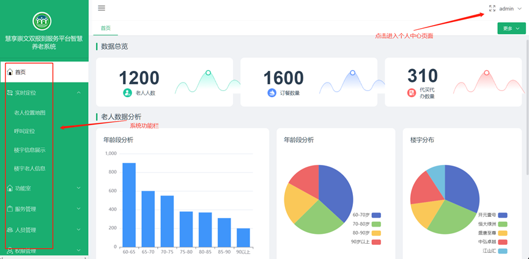

1 引言

1.1 编写目的
本文档旨在对《智慧养老系统》的功能及操作方法进行描述，帮助用户掌握该系统的使用方法。

1.2 适用对象
本文档适用于测试人员、管理人员等使用该系统的操作人员。

1.3 通用操作说明
【搜索】按钮：查询符合条件的信息。
【添加】按钮：打开新建窗口，新建相应类型的信息。
【修改】按钮：打开修改窗口，修改并保存当前数据行的详细信息。
【删除】按钮：删除当前数据行，删除时会有相应提示操作。
【导出】按钮：导出当前已选中的数据。

2 系统运行环境需求
硬件运行环境包括服务器硬件环境、客户端计算机硬件配置环境，详见下表。
表2.1-1 客户端计算机软硬件配置环境
配置	硬件规格要求
处理器	双核2.0G以上
内存	2G以上
硬盘	100G以上
显示器	分辨率：1920*1080；显示比例：100%
浏览器	谷歌浏览器；显示比例：100%

3 系统功能介绍

3.1 登录系统
在浏览器地址栏中输入系统的访问地址，进入登录界面。在用户名框、密码框输入正确的用户登录名和密码，单击【登录】按钮即可登录本系统。系统将根据用户的身份及权限范围进入相应的系统主界面，若用户名、密码输入错误，或者不输入用户名、密码，则不能登录本系统。本文以系统管理员用户对系统功能进行描述。

3.2 主界面 
图文结合对系统首页操作进行描述，主界面主要分别三个部分：
单击左上角【首页】按钮，系统转换到登录后默认主界面。
单击右上角【用户名】按钮，修改密码或者退出系统关闭当前界面。
左边侧边栏为功能栏，可查看使用系统功能。
 
3.4 实时定位
3.4.1 老人位置地图
管理员通过地图了解到系统内老人的实时定位数据。
 
 
3.4.2 呼叫定位
管理员可以在地图上查看老人进行呼叫时的信息展示，可根据呼救、订餐、代买代办按钮查看不同信息并进行处理。
 
 
3.4.3 楼宇信息展示
管理员可点击地图上不同的楼宇，查看该楼宇中登记的老人信息。
 
 
3.4.4 楼宇老人信息展示
老人在社区是处于一直移动状态，管理员可根据楼宇老人信息来查看当前楼宇中是那些老人在里面。
 
3.5 功能室
管理端功能室主要用于添加文章信息，小程序端多数板块涉及到文章展示，需要在功能室进行文章添加、修改、删除。
 
3.5.1 长者之家
 
 
3.5.2 健康之家
 
 
3.5.3 暖心阁
 
 
3.5.4 幸福之家
 
 
3.5.5 善行义举
添加善行义举文章时需要注意，该板块涉及到两个类型：公益事项、捐款捐物，我们在添加时候需要进行选择。
 
 
3.5.6 幸福时光
 
 
3.5.7 活动预告
 
 
3.5.8 健康养生
 
 
3.5.9 暖心服务
 
 

3.6 服务管理

3.6.1 配餐计划
管理员需要配置每日的订餐信息，订餐类型分为早、中、晚三餐，需要进行单独设置。每一餐在配置时需要设置该餐的开始结束时间，在时间内用户可以进行订餐，超出或者未到时间用户不可以进行预定。已添加的配餐任务，若该任务状态为未开始，管理者可以对任务进行修改，若是进行中或者已结束的不能进行修改。
 
 
3.6.2 订餐记录
用户预约订餐后，管理员可以在订餐记录查询已订餐的人员信息，可以使用导出按钮导出订餐人员名单进行订餐配送服务。完成订餐配送后，管理员需要在订餐记录中点击‘完成’按钮，完成该次任务。用户订餐记录也会同步更新订餐状态。
 
3.6.3 代买代办类别
管理员可对代买代办展示板块进行设置，图标上传、介绍内容修改。
 
3.6.4 代买代办记录
小程序端用户发起的代买代办需求后，管理员可在该板块进行查看处理，已完成的任务需要点击完成按钮，同时用户端也会收到微信消息提醒。
 
3.6.5 团队信息管理
孝老团队人员信息管理，管理员可以添加团队、修改团队信息、增加团队成员操作。
 
 
 
 
 
3.6.6 征集意见管理
用户反馈意见信息在这里统一展示，管理员可查看所有用户反馈意见信息。
 
3.6.7 智慧助老管理
小程序端智慧助老页面展示信息修改，管理员可根据需要进行图片、内容信息修改。
 
3.6.8 一键呼叫号码管理
管理员可设置一键呼叫号码，用户使用呼叫功能时可直接拨打到该号码。
 
3.6.9 捐资捐物管理
小程序端用户发出的捐资捐物信息后，管理员可在该页面进行查看并通过用户留的电话进行联系。
 
3.7 人员管理

3.7.1 楼宇信息管理
管理员需要录入社区的楼宇信息。
 
 
3.7.2 老人信息管理
管理员需要对老人信息进录入，已录入的老人在登录小程序后会自动匹配，标识该用户为老人。
 
 
3.7.3 家人认证
小程序端用户发起家人认证后，管理员可在该页面查看管理认证信息，确认信息正确无误后，修改该认证信息状态为认证通过。若认证信息存在问题，需要修改认证信息为不通过且填写不通过原因。
 
 
3.8 系统管理

3.8.1 用户管理
添加登录系统用户账号，管理员可以根据需要新增用户。
 
 
3.8.2 角色管理
管理角色可查看的权限。
 
